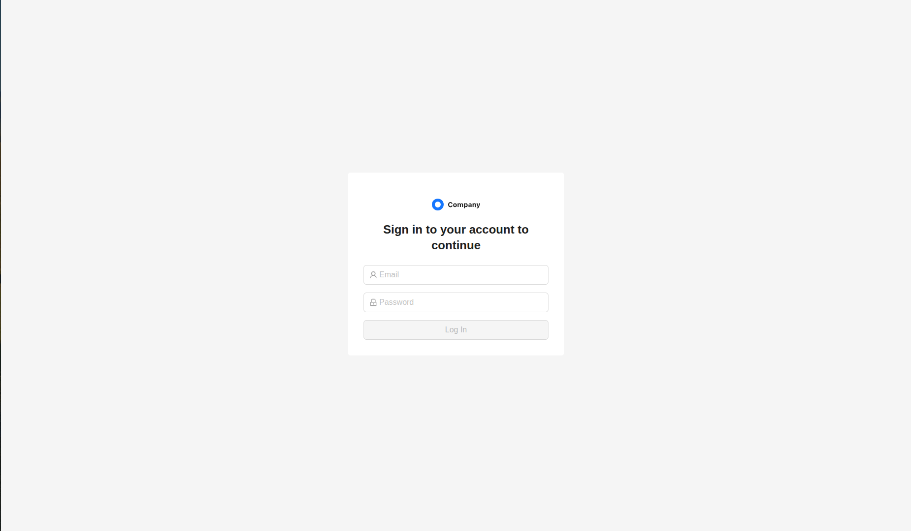
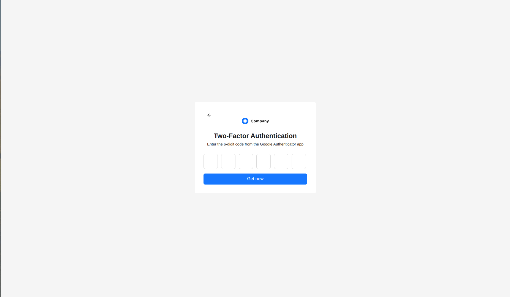

# About
Стек:
React, TypeScript, Vite, Zustand, React Query, Tailwind, Ant-design, emotion

Страница двухфакторной авторизации.

# dev
В корне проекта запустить.
```shell
npm i && npm run dev
```

# How is works


